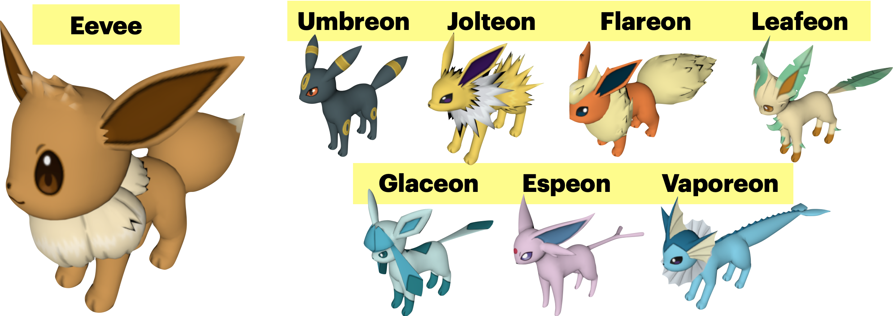

# **Starter Project:** Generating Eeveelution Point Clouds With Point Set Generation Network
## Repo By Vadim Kudlay

Files in `objs/` are the object files used in the experiment. These have been sources as noted in the main jupyter notebook. 

**For reference, the actual meshes look like the following:** 

These were sourced from [Models-Resource.com](https://www.models-resource.com/3ds/pokemonxy/) with 
no intention of commercial use.